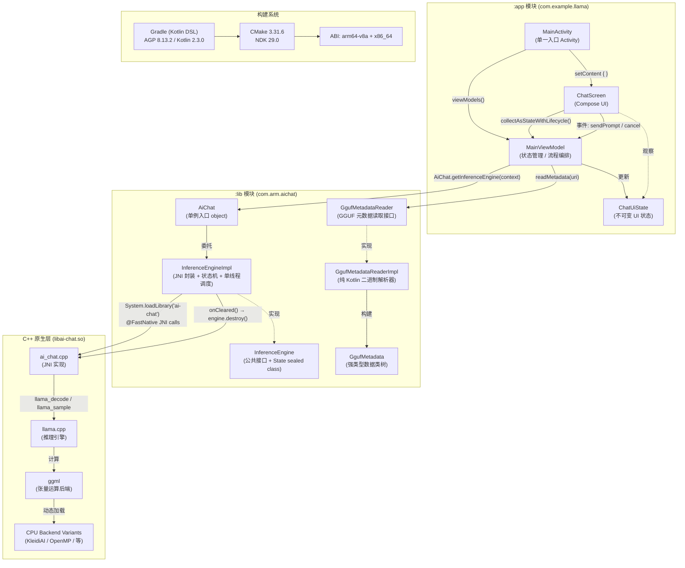
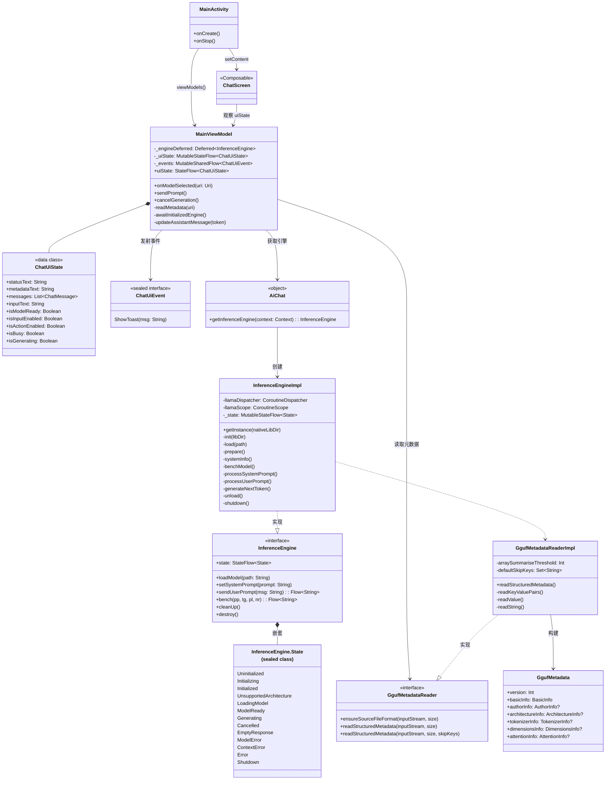
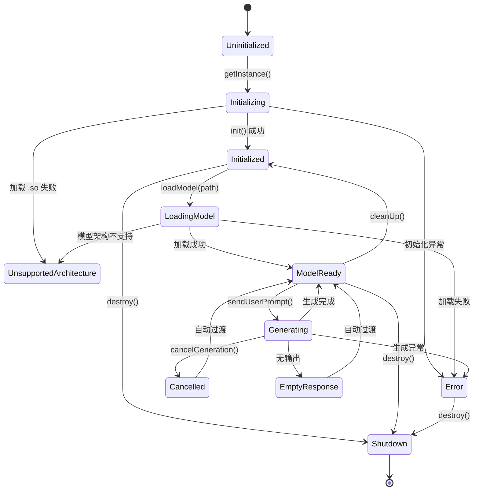
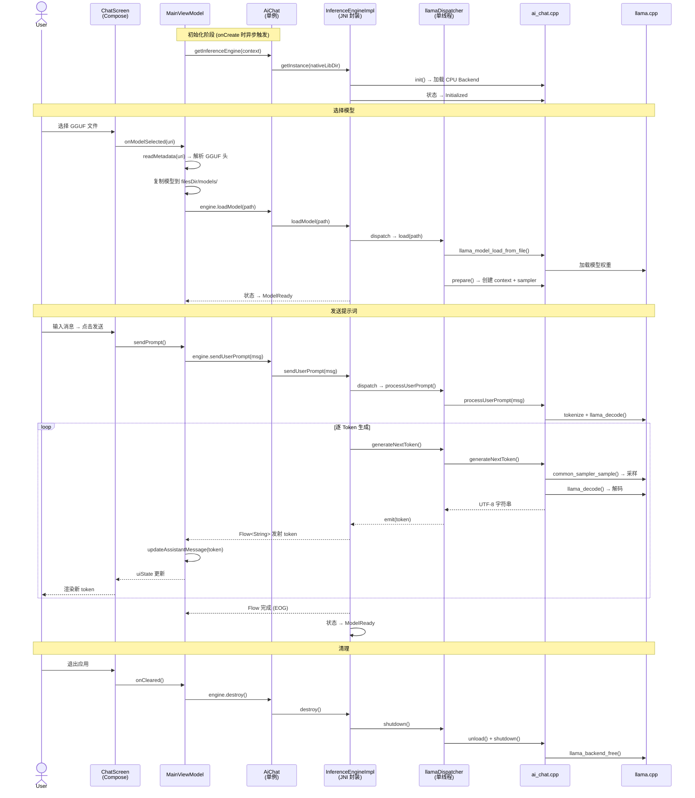
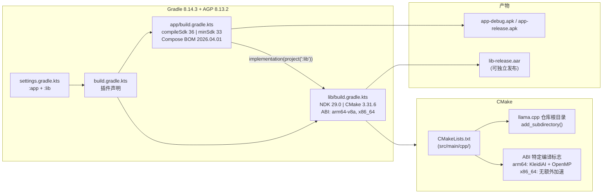
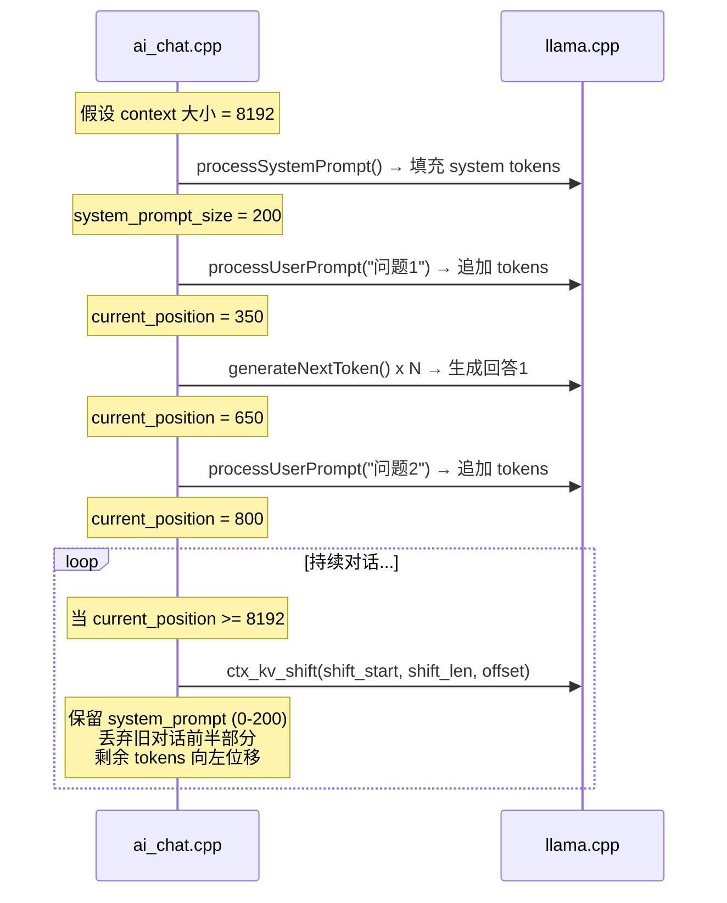

# llama.android 架构图

## 一、完整架构总览



### 模块划分

| 模块 | 包名 | 类型 | 职责 |
|------|------|------|------|
| `:app` | `com.example.llama` | Android Application | 示例 UI 消费者，展示库用法 |
| `:lib` | `com.arm.aichat` | Android Library | 可复用的推理库 (JNI + GGUF 解析) |
| native | `libai-chat.so` | C++ Shared Lib | JNI 桥接 + llama.cpp 封装 |

### 核心设计模式

| 模式 | 位置 | 说明 |
|------|------|------|
| **MVVM** | `:app` | ViewModel 持有 StateFlow，Compose 观察 |
| **单例 (Double-Checked Locking)** | `InferenceEngineImpl` | `@Volatile` + `synchronized` 确保唯一实例 |
| **状态机** | `InferenceEngine.State` | 13 种 sealed class 状态，每次操作带 `check()` 守卫 |
| **单线程调度器** | `llamaDispatcher` | `Dispatchers.IO.limitedParallelism(1)` 保证 C++ 线程安全 |
| **Stream 输出** | `sendUserPrompt()` | 返回 `Flow<String>`，Token 逐个发射 |
| **流式解析** | `GgufMetadataReaderImpl` | 读取二进制 GGUF 头部元数据，跳过大型数组 |
| **Context Shifting** | `ai_chat.cpp` | 超 8192 token 时丢弃旧上下文并位移 |

---

## 二、类图



### 状态机流转



---

## 三、时序图：从用户输入到 Token 生成



### 关键异步机制

| 阶段 | 线程 | 调度器 | 说明 |
|------|------|--------|------|
| 引擎初始化 | 后台 | `Dispatchers.Default` + `viewModelScope.async` | 延迟初始化，多处 `await()` |
| 模型加载 | 串行 | `llamaDispatcher` (IO, parallelism=1) | 防止并发操作 C++ 全局状态 |
| Token 生成 | 串行 | `llamaDispatcher` | 每个 token 通过 Flow emit |
| UI 更新 | 主线程 | `collectAsStateWithLifecycle()` | Compose 自动重组 |
| GGUF 解析 | I/O | `Dispatchers.IO` | 纯 Kotlin，不涉及 JNI |

---

## 四、构建系统



### Gradle 传递给 CMake 的参数

```
-DBUILD_SHARED_LIBS=ON
-DLLAMA_BUILD_COMMON=ON
-DLLAMA_OPENSSL=OFF
-DGGML_NATIVE=OFF
-DGGML_BACKEND_DL=ON
-DGGML_CPU_ALL_VARIANTS=ON
-DGGML_LLAMAFILE=OFF
```

---

## 五、Context Shifting 机制


